# AXIS【ASSET x InformationSystem】使い方ガイド

> AIを活用したCAD図面の自動解析・管理システム

---

## 目次

1. [ホーム画面](#1-ホーム画面)
2. [図面アップロード](#2-図面アップロード)
3. [図面一覧](#3-図面一覧)
4. [図面詳細・編集](#4-図面詳細編集)
5. [回転確定・再分析](#5-回転確定再分析)
6. [自然言語検索](#6-自然言語検索)
7. [工程一覧（ライン管理）](#7-工程一覧ライン管理)
8. [ライン詳細（図面ツリー）](#8-ライン詳細図面ツリー)
9. [設備詳細](#9-設備詳細)
10. [摘要表一覧](#10-摘要表一覧)
11. [摘要表詳細](#11-摘要表詳細)
12. [摘要表の紐づけ変更](#12-摘要表の紐づけ変更)
13. [摘要表の新規作成・編集](#13-摘要表の新規作成編集)
14. [OracleDBからのインポート](#14-oracledbからのインポート)

---

## 1. ホーム画面

AXISを開くと、各機能へのナビゲーションカードが表示されます。

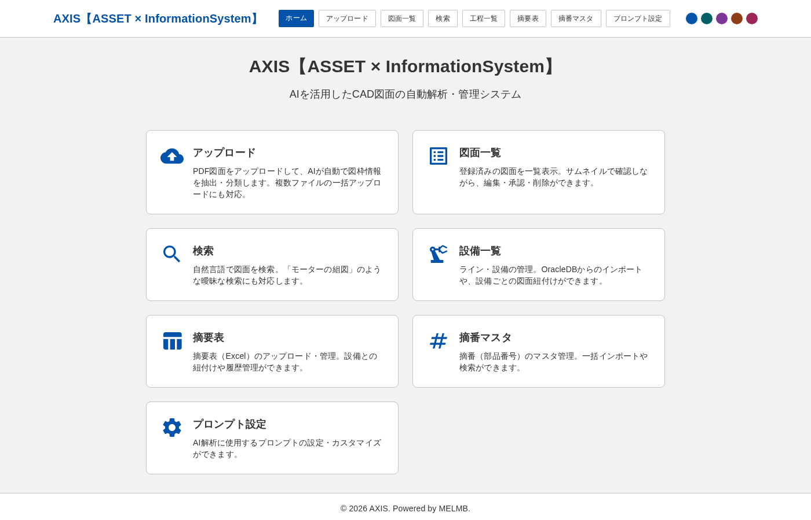

| カード | 説明 |
|---|---|
| **アップロード** | PDF図面をアップロードしてAI自動解析 |
| **図面一覧** | 登録済み図面の一覧表示・承認・削除 |
| **検索** | 自然言語による図面検索 |
| **設備一覧** | ライン・設備の管理、OracleDBインポート |
| **摘要表** | 摘要表（部品表）の管理 |
| **摘番マスタ** | 摘番（部品番号）のマスタ管理 |
| **プロンプト設定** | AI解析プロンプトのカスタマイズ |

上部ナビゲーションバーからも各画面にアクセスできます。右上のカラーパレットでテーマカラーを変更できます。

---

## 2. 図面アップロード

PDF形式のCAD図面をアップロードします。複数ファイルの一括アップロードに対応しています。

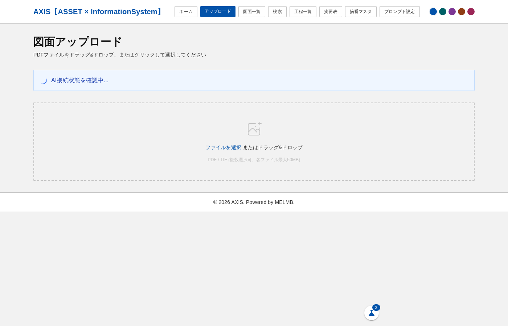

### 操作手順

1. **「ファイルを選択」をクリック**、またはファイルをドラッグ＆ドロップ
   - 対応形式: PDF / TIF（各ファイル最大50MB）
   - 複数ファイル選択可
2. ファイル選択後、**自動的にアップロードとAI解析が開始**
3. WebSocketによるリアルタイム進捗表示で、解析状況を確認
4. 解析完了後、図面一覧に自動登録

### AI自動解析の内容

アップロードされた図面に対して、以下の処理が自動実行されます:

- **回転検出**: 図面の正しい向きを自動判定
- **分類**: 部品図 / 組図 / ユニット図に自動分類
- **図枠情報抽出**: 図番、タイトル、作成日、承認者など
- **風船抽出**: 組図・ユニット図の風船番号と部品名
- **サムネイル生成**: 一覧表示用のサムネイル画像

---

## 3. 図面一覧

登録済みの図面をサムネイル付きで一覧表示します。

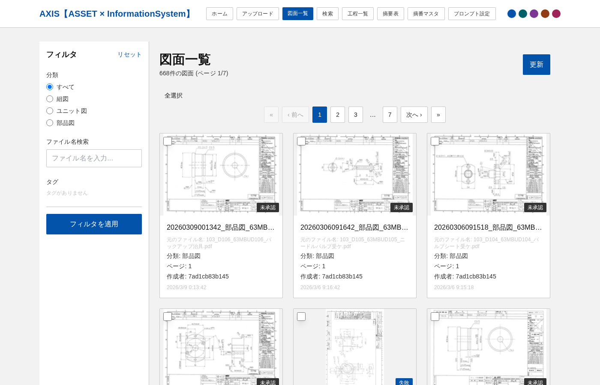

### 主な機能

- **フィルタ**: 左サイドバーで分類（組図/部品図/ユニット図）、承認状態でフィルタリング
- **ページネーション**: 上下に配置されたページ送りで大量の図面を効率的に閲覧
- **承認**: 図面の承認状態を管理
- **一括削除**: チェックボックスで複数図面を選択して一括削除
- **図面クリック**: サムネイルをクリックすると詳細・編集画面に遷移

---

## 4. 図面詳細・編集

図面のPDFプレビューと、AI解析結果の確認・編集ができます。

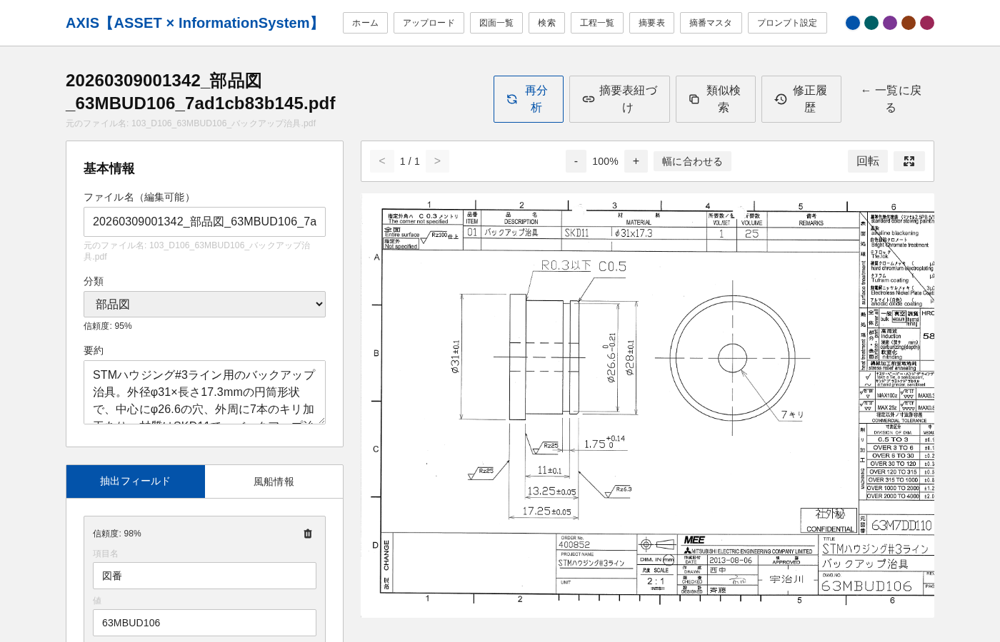

### 画面構成

| エリア | 内容 |
|---|---|
| **左パネル** | 基本情報（ファイル名、分類、要約）、抽出フィールド（図番、図面タイトル等）、風船情報 |
| **右パネル** | PDFプレビュー（拡大・縮小・回転対応） |
| **上部ボタン** | 回転を確定、再分析、摘要表紐づけ、類似検索、修正履歴、一覧に戻る |

### 編集操作

- **ファイル名**: クリックで直接編集可能
- **分類**: ドロップダウンで変更可能
- **抽出フィールド**: 各フィールドを手動で修正可能
- **PDFプレビュー**: 拡大・縮小、幅に合わせる、回転操作

---

## 5. 回転確定・再分析

AI解析時の回転が正しくない場合、手動で修正できます。

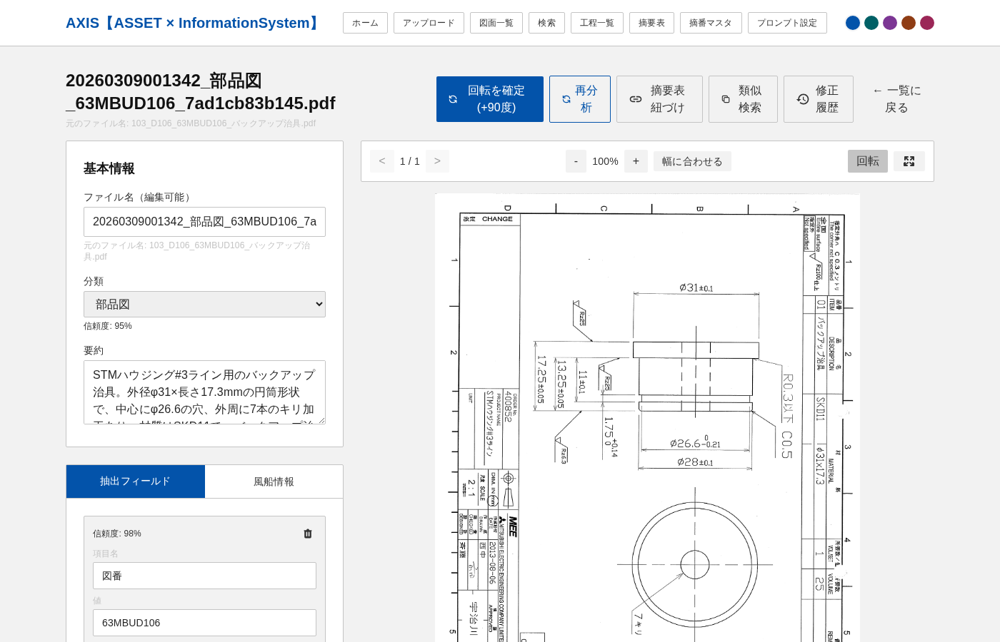

### 回転確定の手順

1. PDFプレビュー右上の**「回転」ボタン**をクリック（90度ずつ回転）
2. 正しい向きになったら、上部の**「回転を確定（+90度）」ボタン**をクリック
3. 確定すると:
   - プレビューが確定した向きで表示
   - サムネイルが自動再生成
   - 一覧画面のサムネイルにも反映

### 再分析の手順

1. 上部の**「再分析」ボタン**をクリック
2. 現在の回転方向を保持したまま、図枠情報の再抽出を実行
3. 回転検出はスキップされるため、ユーザーが確定した向きが維持されます

---

## 6. 自然言語検索

AIを活用して、自然な日本語で図面を検索できます。

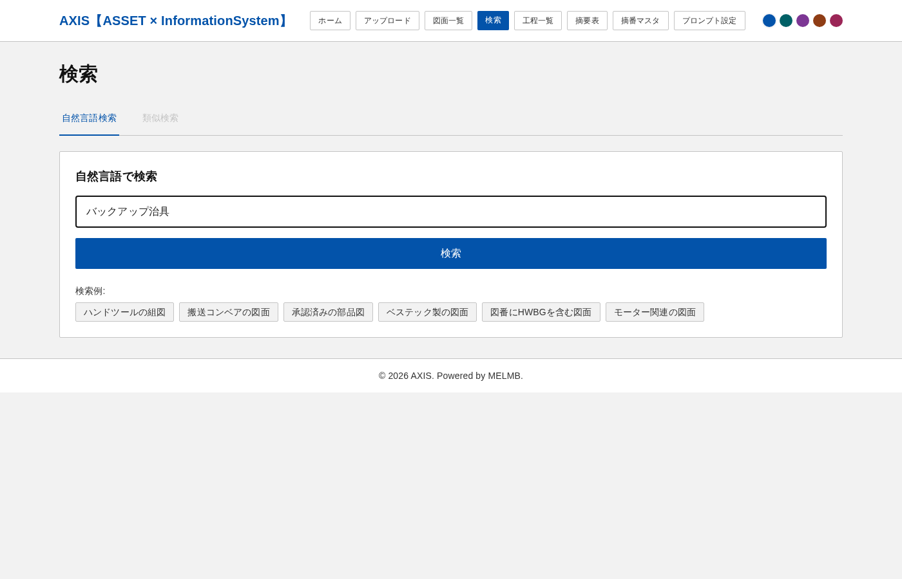

### 操作手順

1. 検索ボックスに**自然な日本語**で検索ワードを入力
   - 例: 「バックアップ治具」「モーターの組図」「承認済みの部品図」
2. **「検索」ボタン**をクリック
3. AIがクエリを解析し、該当する図面を表示

### 検索のヒント

- 検索例のチップ（「ハンドツールの組図」など）をクリックすると、その文言で検索できます
- **類似検索タブ**: 特定の図面と似た図面を探すこともできます

---

## 7. 工程一覧（ライン管理）

製造ラインの一覧表示と管理を行います。

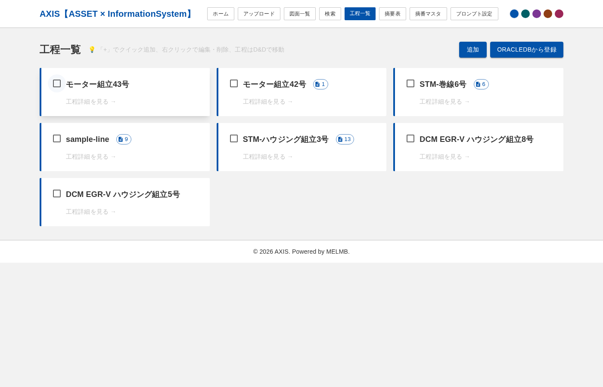

### 主な機能

- **ライン一覧**: 登録済みの製造ラインをカード形式で表示
- **摘要表バッジ**: 各ラインに紐づく摘要表の件数を表示
- **追加**: 「追加」ボタンから新規ラインを手動作成
- **OracleDBから登録**: Oracle生産管理システムからライン・工程をインポート
- **一括削除**: チェックボックスで選択して一括削除
- **工程詳細を見る**: クリックでライン詳細画面に遷移

---

## 8. ライン詳細（図面ツリー）

ラインに紐づく設備・工程・図面を階層ツリーで管理します。

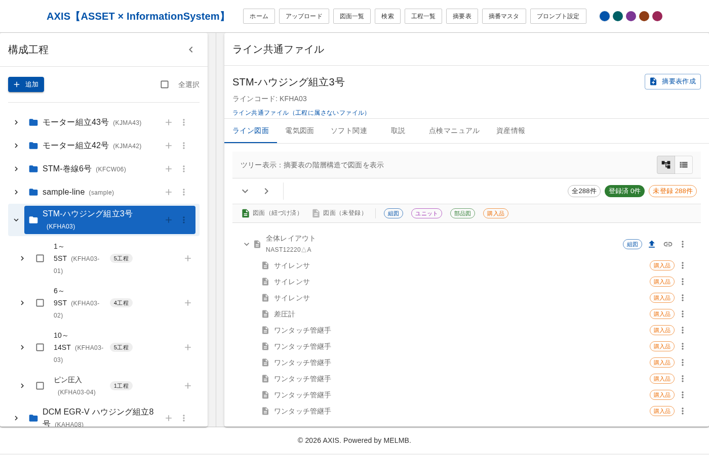

### 画面構成

| エリア | 内容 |
|---|---|
| **左サイドバー** | 構成工程ツリー（ライン → 設備 → 工程） |
| **右パネル** | 選択項目の詳細情報、図面ツリー、タブ切替 |

### 左サイドバー（構成工程ツリー）

- **ライン**: フォルダアイコンで表示。ラインコードも併記
- **設備**: ライン配下の設備。工程数バッジ付き
- **＋ボタン**: 設備の追加
- **⋮メニュー**: 名前変更、削除などの操作

### 右パネル（タブ切替）

| タブ | 内容 |
|---|---|
| **ライン図面** | 図面ツリー（摘要表の階層構造で図面を表示） |
| **電気図面** | 電気関連の図面 |
| **ソフト関連** | ソフトウェア関連ドキュメント |
| **取説** | 取扱説明書 |
| **点検マニュアル** | 点検マニュアル |
| **資産情報** | 設備の資産管理情報 |

### 図面ツリーの操作

- **組図/ユニット/部品図/購入品**: フィルタチップで種別を絞り込み
- **アップロード**: ＋ボタンから図面をアップロード
- **子摘要表作成**: 図面行のメモアイコンから子摘要表を作成
- **摘要表作成**: 右上の「摘要表作成」ボタンから新規摘要表を作成

---

## 9. 設備詳細

設備に紐づく工程・図面の管理画面です。

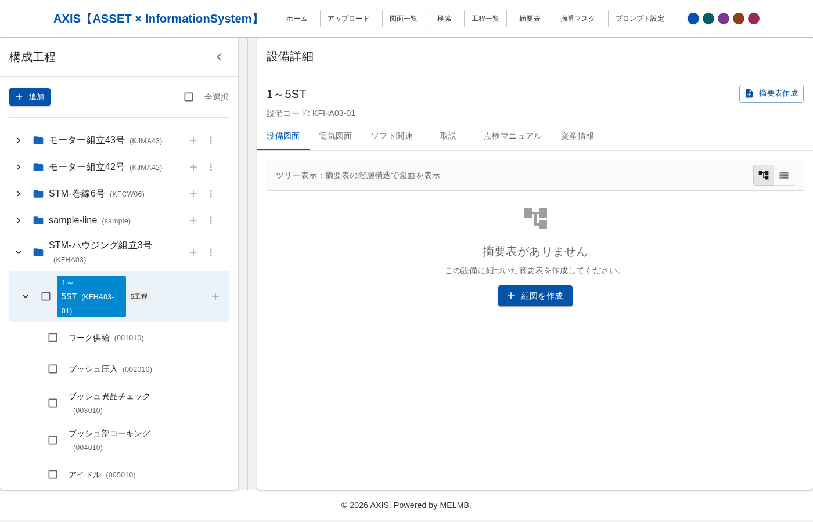

### 操作

- 設備配下の**工程一覧**を確認
- 各工程に紐づく**図面・摘要表**を管理
- タブを切り替えて各カテゴリの資料を管理

---

## 10. 摘要表一覧

登録済みの摘要表（部品表）を一覧表示します。

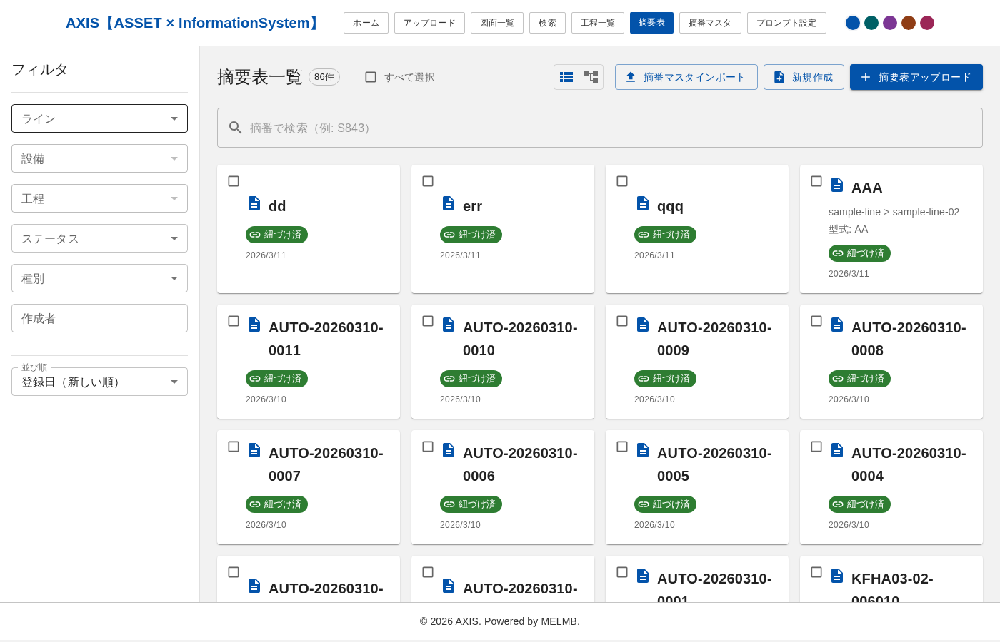

### 主な機能

- **フィルタ**: 左サイドバーでライン、設備、工程、ステータス、種別でフィルタリング
- **検索**: 摘番で検索
- **表示切替**: リスト表示 / カード表示を切替
- **紐づけ済**: 緑色のバッジで紐づけ状態を表示
- **新規作成**: 「新規作成」ボタンから手動作成
- **摘要表アップロード**: Excelファイルから摘要表をインポート
- **摘番マスタインポート**: 摘番マスタデータの一括インポート

---

## 11. 摘要表詳細

摘要表の部品リストと図面紐づけ状態を確認・管理します。

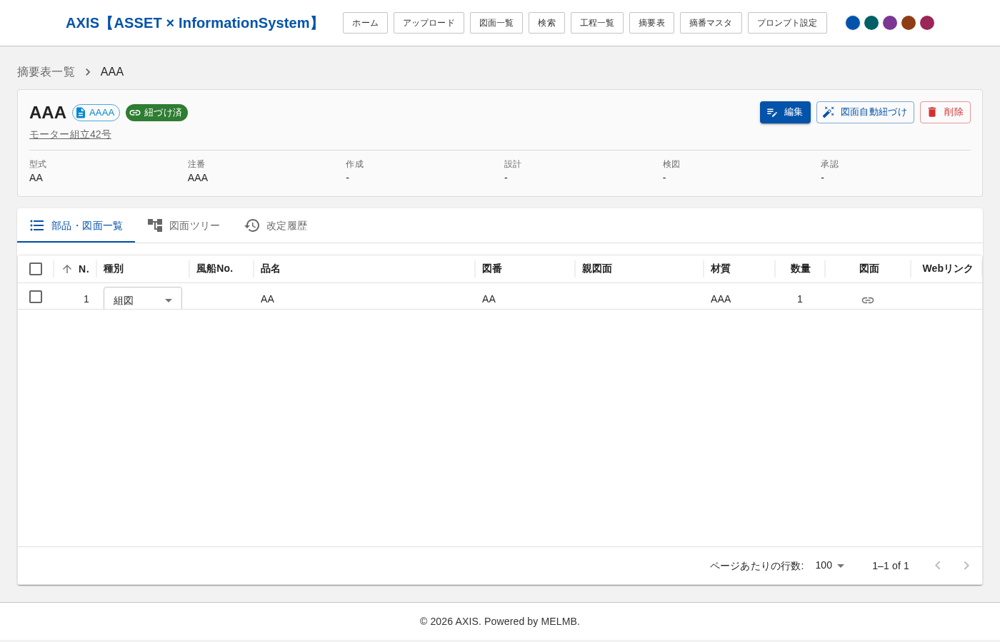

### 画面構成

- **ヘッダー**: 摘番、図番、紐づけ状態チップ、紐づけ先パス
- **メタ情報**: 型式、注番、作成者、設計、検図、承認
- **タブ**: 部品・図面一覧 / 図面ツリー / 改定履歴

### 部品・図面一覧（DataGrid）

| 列 | 説明 |
|---|---|
| **N.** | 行番号 |
| **種別** | 組図 / ユニット / 部品 / 購入品 |
| **風船No.** | 組図の風船番号との対応 |
| **品名** | 部品名 |
| **図番** | 図面番号 |
| **親図面** | 親ユニットの図番 |
| **材質** | 材料・メーカー |
| **数量** | 数/セット |
| **図面** | 紐づけ図面の確認・リンクアイコン |
| **Webリンク** | 外部参照リンク |

### 操作

- **編集**: 「編集」ボタンで摘要表の内容を編集
- **図面自動紐づけ**: 図番をもとにAIが図面を自動マッチング
- **削除**: 摘要表の削除

---

## 12. 摘要表の紐づけ変更

摘要表をどのライン・設備・工程に紐づけるかを変更できます。

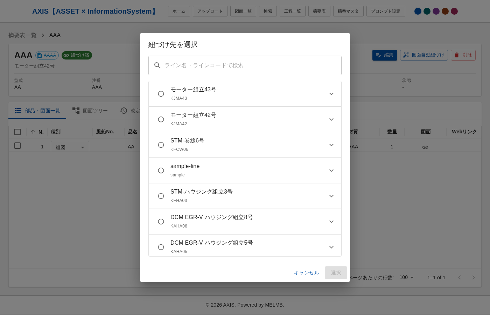

### 操作手順

1. 摘要表詳細画面の**「紐づけ済」チップ**（緑色）をクリック
2. 「紐づけ先を選択」ダイアログが表示
3. **ライン一覧**が表示される（検索フィルタ対応）
4. ラインをラジオボタンで選択（ライン直接紐づけ）
5. または、ラインを展開して**設備**を選択
6. さらに設備を展開して**工程**を選択することも可能
7. **「選択」ボタン**で紐づけを確定
8. **「紐づけ解除」ボタン**で紐づけを解除することも可能

---

## 13. 摘要表の新規作成・編集

### 新規作成

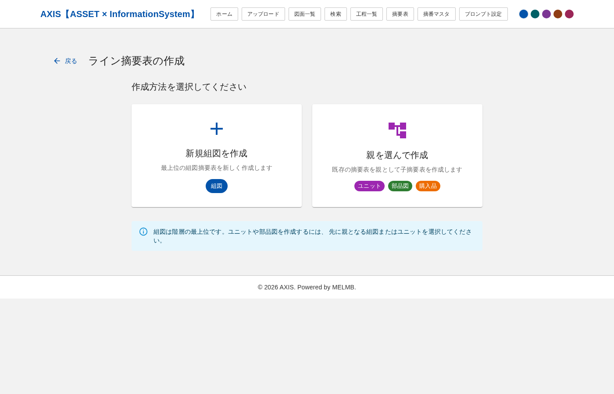

1. 摘要表一覧の**「新規作成」ボタン**、またはライン詳細の**「摘要表作成」ボタン**をクリック
2. 紐づけ先（ライン/設備/工程）を選択
3. 種別を選択（組図/ユニット/部品図/購入品）
4. 摘番、図番などの基本情報を入力
5. 部品アイテムを行単位で入力
6. **Excelからのコピー＆ペースト対応**: Excelで範囲選択してコピー → グリッドに貼り付けると自動で行が追加されます

### 編集

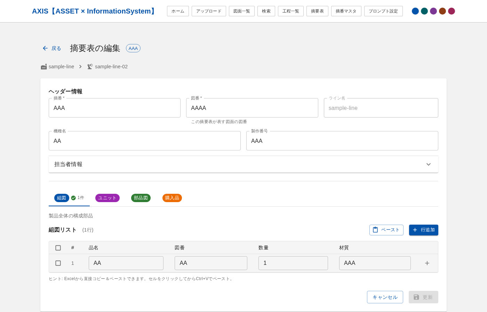

- 摘要表詳細画面の**「編集」ボタン**をクリック
- 基本情報の修正、アイテムの追加・削除・並べ替えが可能
- 種別タブ（ユニット/部品図/購入品）を切り替えて、各種別のアイテムを管理

---

## 14. OracleDBからのインポート

既存の生産管理システム（Oracle Database）からライン・工程情報をインポートできます。

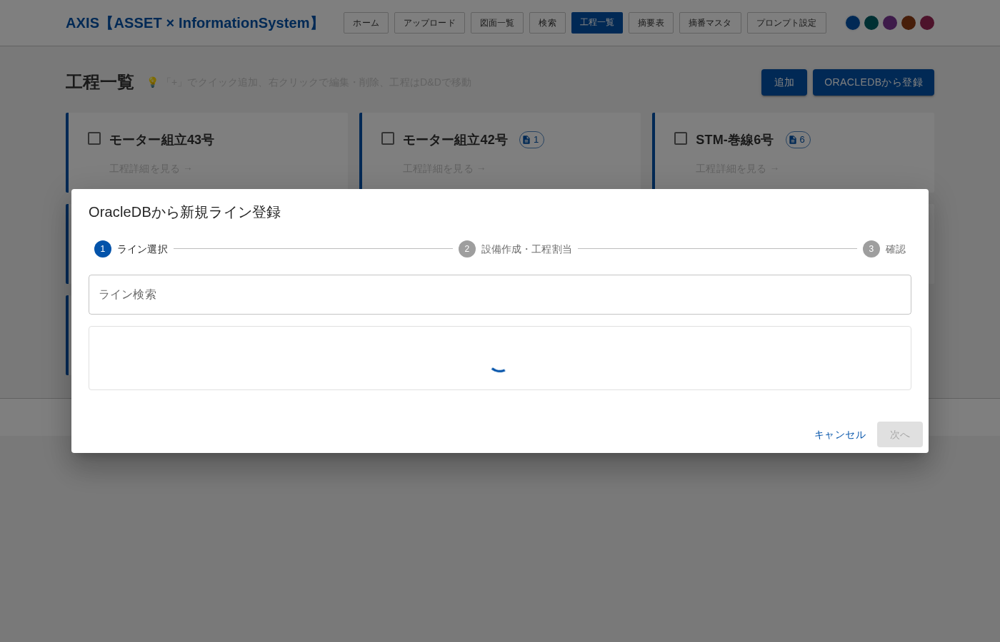

### 操作手順（3ステップウィザード）

**ステップ1: ライン選択**
1. 工程一覧画面の**「ORACLEDBから登録」ボタン**をクリック
2. ダイアログにOracleDBのライン一覧が表示
3. 検索フィルタでラインを絞り込み
4. インポートするラインを選択

**ステップ2: 設備作成・工程割当**
1. Oracleの工程一覧が左側に表示
2. 右側で設備を手動作成
3. 工程を設備にドラッグ＆ドロップで割当

**ステップ3: 確認**
1. インポート内容を確認
2. 「登録」ボタンで一括登録
3. 完了後、ライン詳細画面に自動遷移

---

## よくある操作

### 図面の向きがおかしい場合

1. 図面一覧から該当図面をクリック
2. 詳細画面でPDFプレビューの「回転」ボタンをクリック
3. 正しい向きになったら「回転を確定」をクリック
4. 必要に応じて「再分析」で図枠情報を再抽出

### 摘要表と図面を紐づけたい場合

1. 摘要表詳細画面を開く
2. 「図面自動紐づけ」ボタンをクリック
3. AIが図番をもとに候補を提示
4. 候補を確認して紐づけを実行

### Excelから摘要表データを入力したい場合

1. 摘要表作成または編集画面を開く
2. Excelで入力したいデータ範囲を選択してコピー（Ctrl+C）
3. グリッドの貼り付けたいセルをクリック
4. ペースト（Ctrl+V）すると自動で行が追加されます

---

## アクセス情報

| 項目 | URL |
|---|---|
| フロントエンド | http://localhost:5175 |
| バックエンドAPI | http://localhost:8000 |
| APIドキュメント | http://localhost:8000/docs |

---

> **AXIS【ASSET x InformationSystem】** - AIを活用したCAD図面の自動解析・管理システム
