# QUICK 生産管理システム - 使い方ガイド

> **アクセスURL: `http://10.168.124.32:8001/`**

---

## 目次

1. [ログイン](#1-ログイン)
2. [ライン選択](#2-ライン選択)
3. [ライン一覧](#3-ライン一覧)
4. [ダッシュボード](#4-ダッシュボード)
5. [生産計画の管理](#5-生産計画の管理)
6. [計画の作成・編集](#6-計画の作成編集)
7. [Excel一括登録](#7-excel一括登録)
8. [カウント対象設備の設定](#8-カウント対象設備の設定)
9. [実績一覧](#9-実績一覧)
10. [トラブル分析](#10-トラブル分析)
11. [AI分析](#11-ai分析)
12. [管理画面（Admin）](#12-管理画面admin)

---

## 1. ログイン

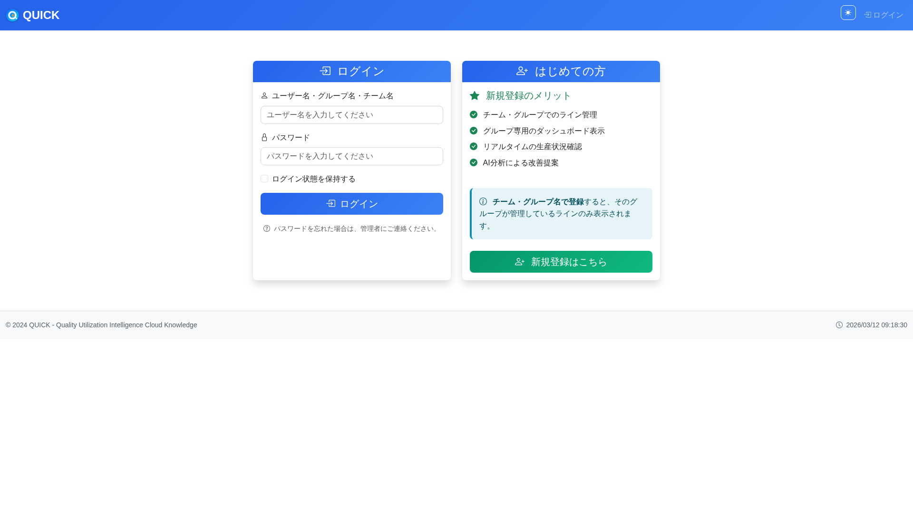

### 操作手順
1. ブラウザで `http://10.168.124.32:8001/` にアクセス
2. **ユーザー名**と**パスワード**を入力
3. 「ログイン」ボタンをクリック

### はじめての方
- 右側の「**新規登録はこちら**」からアカウントを作成できます
- チーム・グループ名で登録すると、そのグループが管理しているラインのみ表示されます

---

## 2. ライン選択

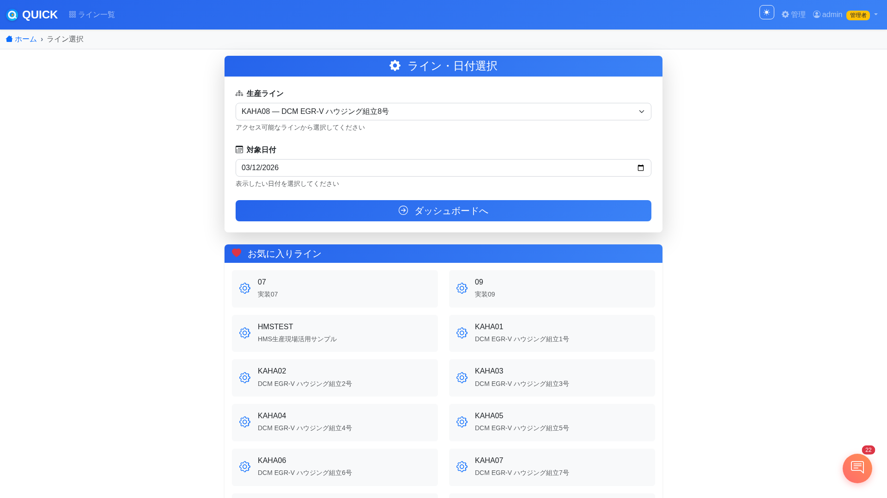

ログイン後に表示される画面です。

### 操作手順
1. **生産ライン**のプルダウンから、表示したいラインを選択
2. **対象日付**を設定（デフォルトは今日）
3. 「**ダッシュボードへ**」ボタンをクリック

### お気に入りライン
- 画面下部に**お気に入りライン**が表示されます
- クリックすると、そのラインのダッシュボードに直接移動できます
- お気に入りラインの設定はナビバーの「マスタ管理」から変更可能です

---

## 3. ライン一覧

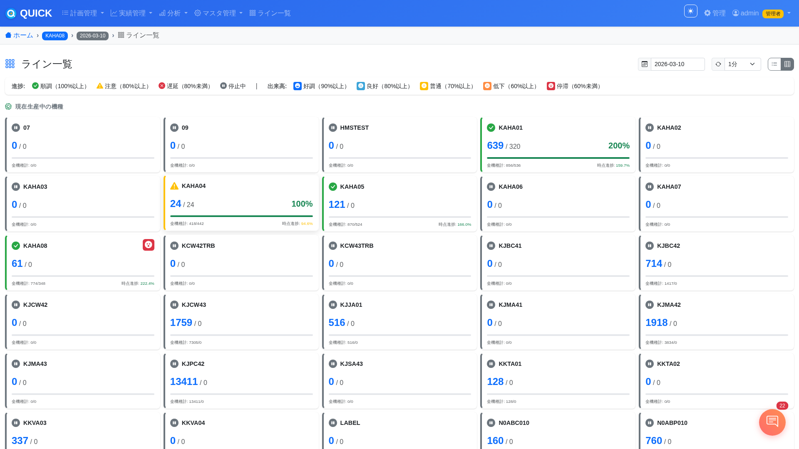

全ラインの生産状況を一覧で確認できる画面です。

### 画面の見方

#### ステータスアイコン（左端の色付きバー）
| アイコン | 意味 | 基準 |
|---|---|---|
| 緑 チェック | 順調 | 時点進捗率 100%以上 |
| 黄 三角 | 注意 | 時点進捗率 80%以上 |
| 赤 バツ | 遅延 | 時点進捗率 80%未満 |
| 灰 一時停止 | 停止中 | 実績なし or 計画なし |

#### 顔アイコン（カード右上）
直近10分間の生産ペース（PPH）を5段階で表示します。

| 色 | 表情 | 意味 |
|---|---|---|
| 青 | 大笑い | 好調（90%以上） |
| 水色 | 笑顔 | 良好（80%以上） |
| 黄 | 無表情 | 普通（70%以上） |
| 橙 | 困り顔 | 低下（60%以上） |
| 赤 | 目が回る | 停滞（60%未満） |

#### カード内の情報
- **ライン名**: ラインの識別名
- **機種名**: 現在生産中の機種
- **実績/目標**: 現在機種の実績数と計画数
- **達成率**: 目標に対する達成率（%）
- **全機種計**: 本日の全機種合計（実績/目標）
- **時点進捗**: 現時点の予定数に対する達成率

### 表示切り替え

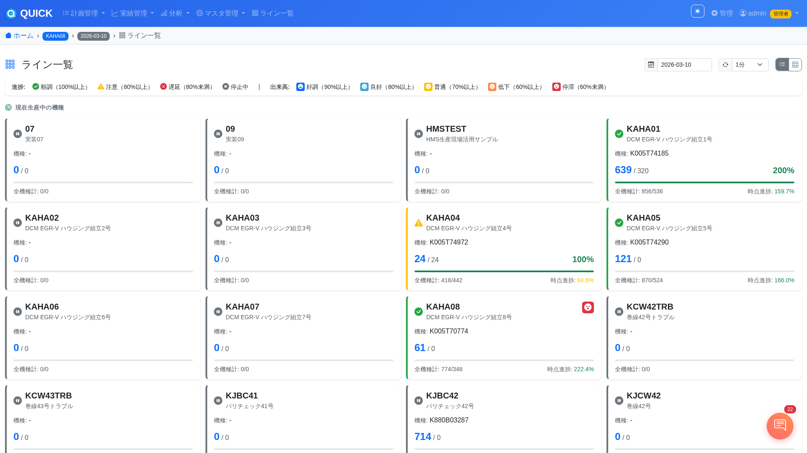

- 右上の **表示切り替えボタン** で「コンパクト」⇔「詳細」を切り替えできます
- **日付ピッカー** で過去の日付のデータも確認可能
- **自動更新** は30秒〜5分の間隔で設定可能（デフォルト: 1分）

---

## 4. ダッシュボード

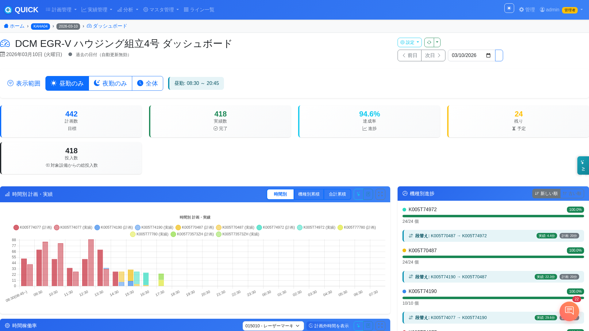

ライン単位の詳細な生産モニターです。WebSocketでリアルタイムに更新されます。

### 画面上部
- **計画数 / 実績数 / 達成率**: 当日の合計値
- **現在の計画**: 現在生産中の機種と目標PPH

### グラフエリア

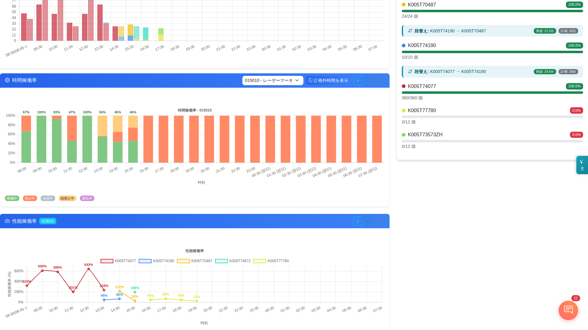

| グラフ | 内容 |
|---|---|
| **時間別 計画・実績** | 1時間ごとの計画数（灰）と実績数（色）を棒グラフで比較 |
| **時間稼働率** | 設備が実際に動いていた時間の割合 |
| **性能稼働率** | 稼働中の生産スピードが計画通りかを表示 |
| **予測線** | 現在のペースで目標を達成できるかを折れ線で予測 |

### 操作
- **表示期間**: 「昼勤のみ」「夜勤のみ」「連勤」で切り替え
- **日付移動**: 日付ピッカーで過去データを閲覧
- **カードをクリック**: ラインカードをクリックすると詳細ダッシュボードに遷移

---

## 5. 生産計画の管理

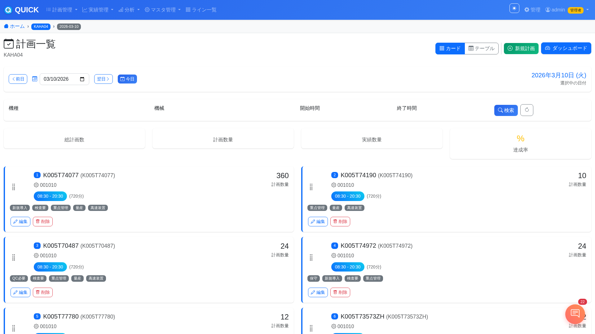

ナビバーの「**計画管理**」からアクセスします。

### 計画一覧の見方
- **カード表示/テーブル表示**: 右上のボタンで切り替え
- 各計画カードには以下が表示されます:
  - 機種名（品番）
  - 設備名
  - 時間帯（開始〜終了）と所要時間
  - 計画数量
  - タグ（カテゴリ情報）

### 操作
- **新規計画**: 右上の「**+ 新規計画**」ボタン
- **編集**: 各カードの「編集」ボタン
- **削除**: 各カードの「削除」ボタン
- **日付移動**: 「前日」「翌日」「今日」ボタンで切り替え
- **ダッシュボード**: 右上の「ダッシュボード」ボタンでダッシュボードに遷移

---

## 6. 計画の作成・編集

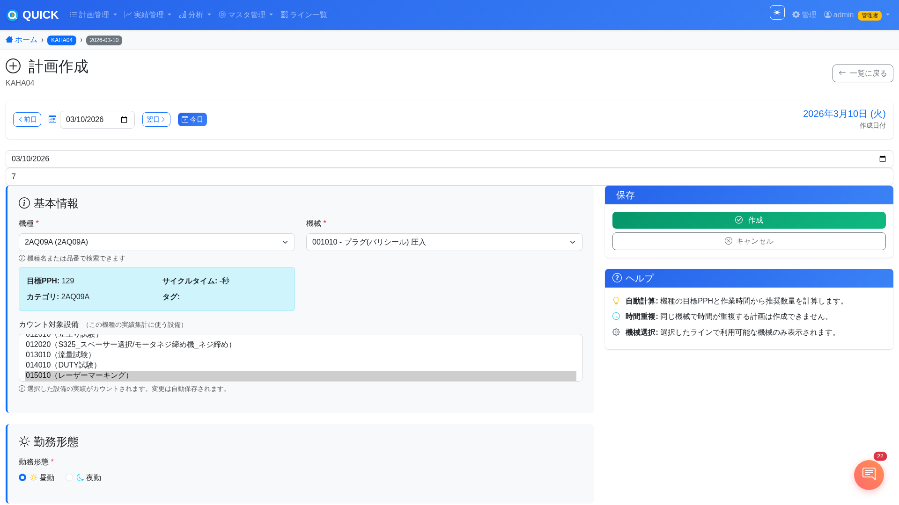

### 入力項目

#### 基本情報
| 項目 | 説明 | 必須 |
|---|---|---|
| **機種** | 生産する機種を選択（名前・品番で検索可能） | ○ |
| **機械** | この計画で使用する設備を選択 | ○ |

機種を選択すると、**目標PPH**・**サイクルタイム**・**カテゴリ**・**タグ**が自動表示されます。

#### 勤務形態
| 項目 | 説明 |
|---|---|
| **昼勤** | 08:30〜20:30（デフォルト） |
| **夜勤** | 20:30〜翌08:30 |
| **前残業** | 夜勤時のみ設定可能。勤務開始前に作業する時間 |

#### 時間設定
- **開始時間/終了時間**: 勤務形態に応じて自動設定されますが、手動変更可能
- **作業時間**: 自動計算で表示（例: 720分）

#### 数量設定
- **計画数量**: 手動入力 or 「**自動計算**」ボタンで推奨数量を算出
- 自動計算: `目標PPH × 作業時間(時間)` で推奨数量を計算

---

## 7. Excel一括登録

計画管理画面からExcelファイルで複数の計画を一括登録できます。

### アクセス方法
1. **計画管理** → 対象ラインの計画一覧画面を開く
2. 右上の「**+ 新規計画**」の横にある「**Excel一括登録**」をクリック
3. または、計画作成画面の上部にある「**Excel一括登録**」タブをクリック

### 操作手順

#### ステップ1: テンプレートのダウンロード
1. 「**テンプレートダウンロード**」ボタンをクリック
2. Excelテンプレートファイルがダウンロードされます
3. テンプレートに計画データを入力して保存

#### ステップ2: ファイルのアップロード
1. 「**ファイルを選択**」でExcelファイルを選択（ドラッグ&ドロップも可能）
2. アップロードが完了するとプレビュー画面が表示されます

#### ステップ3: 確認・登録
1. プレビューで日付・勤務形態・機種名・計画数・人数・時間・設備などを確認
2. 内容に問題がなければ「**ファイルを選択して登録**」をクリック
3. エラーがある場合は赤枠でエラー内容が表示されます → 修正して再アップロード

### テンプレートの入力項目
| 項目 | 説明 | 必須 |
|---|---|---|
| **日付** | 計画日（YYYY-MM-DD形式） | ○ |
| **勤務形態** | 昼勤 / 夜勤 | ○ |
| **機種名** | 生産する機種の名前 | ○ |
| **計画数** | 計画数量 | ○ |
| **人数** | 作業人数 | - |
| **開始時間** | 作業開始時間（HH:MM形式） | - |
| **終了時間** | 作業終了時間（HH:MM形式） | - |
| **設備** | 使用する設備名 | - |
| **備考** | メモ・備考 | - |

### 注意事項
- 一度に複数日分の計画を登録可能です
- 機種名はシステムに登録済みのものと一致する必要があります
- エラーがあった場合、全件がロールバックされます（一部だけ登録されることはありません）

---

## 8. カウント対象設備の設定


> ※ この機能は計画の作成・編集画面内にあります。

### この機能について

機種によっては、ラインの全設備を通らないものがあります。ラインのデフォルトのカウント対象設備を通らない機種は、実績がカウントされません。

この機能を使うと、**機種ごとにどの設備で実績をカウントするか**を設定できます。

### 操作手順
1. 計画作成/編集画面で**機種を選択**
2. 「**カウント対象設備**」セクションが表示される
3. プルダウンから**カウント対象設備を選択**（複数選択可能）
   - 設備は `設備番号（設備名称）` の形式で表示されます
   - 例: `013010（流量試験）`, `015010（レーザーマーキング）`
4. 選択を変更すると**自動保存**されます（「保存しました」バッジが表示）

### 注意事項
- この設定は **ライン × 機種** の組み合わせに対する設定です
- 一度設定すれば、**次回以降の計画でも設定が維持**されます
- 未設定の場合は、ラインのデフォルトカウント対象設備が使用されます
- 管理画面（Admin）の「ライン×機種カウント設備」からも管理できます

---

## 9. 実績一覧

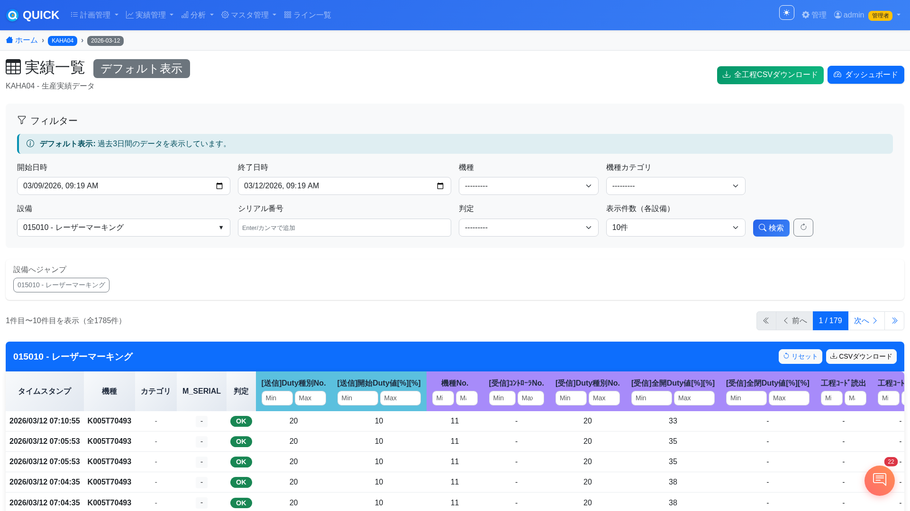

ナビバーの「**実績管理**」からアクセスします。

### 画面の見方
- Oracle生産DBから取得した実績データをリアルタイムに表示
- タイムスタンプ、機種、カテゴリ、シリアル番号、判定結果などが一覧表示

### フィルタ機能
| フィルタ | 説明 |
|---|---|
| **期間** | 開始日時〜終了日時で絞り込み |
| **設備** | チェックボックスで複数設備を選択 |
| **機種/カテゴリ** | 特定の機種やカテゴリで絞り込み |
| **リンク数** | 表示件数の設定 |

### その他
- **CSVエクスポート**: フィルタした結果をCSVでダウンロード可能
- **ダッシュボードへ**: 右上ボタンからダッシュボードに遷移

---

## 10. トラブル分析

ナビバーの「**トラブル**」からアクセスします。設備のトラブル（異常停止）を多角的に分析する画面です。

### アクセス方法
- ナビバーの「**トラブル分析**」をクリック
- またはダッシュボードからリンクで遷移

### フィルタ機能
画面上部で以下のフィルタが利用できます:

| フィルタ | 説明 |
|---|---|
| **日付** | 分析対象日を選択 |
| **シフト** | 「全体」「昼勤」「夜勤」で切り替え |
| **設備** | チェックボックスで複数設備を選択・絞り込み |

フィルタバーにはリアルタイムの**トラブル警告**がマーキー（流れるテキスト）で表示されます。

### タブ構成

#### 概要タブ
6つのKPI（重要指標）カードが表示されます:

| KPI | 意味 |
|---|---|
| **トラブル総件数** | 当日のトラブル発生件数 |
| **総停止時間** | トラブルによる合計停止時間（分） |
| **最多影響設備** | 最もトラブルが多い設備名 |
| **MTBF** | 平均故障間隔（分）- 値が大きいほど安定 |
| **MTTR** | 平均修復時間（分）- 値が小さいほど復旧が早い |
| **可動率** | 設備の稼働可能率（%） |

その他、パレート図（トラブル原因のランキング）やヒートマップ（時間帯×設備の発生分布）も表示されます。

#### 設備分析タブ
- 設備ごとのトラブル発生回数と停止時間を比較
- 設備別のトラブル傾向を棒グラフ・円グラフで可視化

#### 停止分析タブ
- 停止時間の長さ別の分布
- 長時間停止の原因特定に活用

#### トレンドタブ
- 直近期間のトラブル発生推移をグラフで表示
- 増減傾向を把握して予防保全に活用

#### 詳細データタブ
- 全トラブルの一覧表（ソート可能）
- **CSVエクスポート**: データをCSVでダウンロード可能

### AI分析
- 画面右上の「**AI分析**」ボタンをクリック
- サイドバーが開き、AIがトラブルデータを総合的に分析
- 主要なトラブル原因・傾向・改善提案をストリーミング表示

---

## 11. AI分析

ダッシュボード画面から利用できる AI による製造ロス分析機能です。

### 使い方

#### 総合AI分析
1. ダッシュボード右上の **AIアイコン** をクリック
2. サイドバーが開き、4軸分析が並列実行されます:
   - 立ち上げ遅れ分析
   - OEE（総合設備効率）分析
   - 停止・段替え分析
   - 機種別分析
3. 分析結果の最後に**優先改善アクション**（最大3つ）が提案されます

#### グラフ別AI分析
1. 各グラフヘッダーの **★アイコン** をクリック
2. そのグラフのデータに特化した詳細分析がストリーミング表示されます
3. 対象グラフ: 時間別計画・実績 / 時間稼働率 / 性能稼働率 / 良品率

---

## 12. 管理画面（Admin）

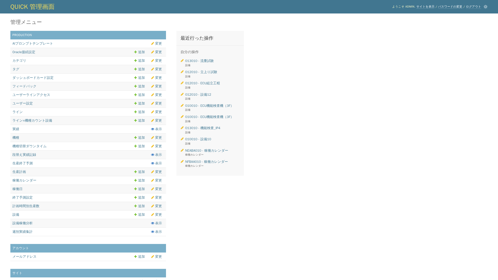

**URL: `http://10.168.124.32:8001/admin/`**

管理者権限を持つユーザーが、マスタデータやシステム設定を管理する画面です。

### 主な管理項目

| 項目 | 説明 |
|---|---|
| **ライン** | 生産ラインの追加・編集（停止判定時間の設定含む） |
| **設備** | 設備のカウント対象フラグ、生産稼働フラグの管理 |
| **機種** | 機種マスタの管理（目標PPH、品番等） |
| **カテゴリ/タグ** | 機種の分類管理 |
| **ライン×機種カウント設備** | 機種別のカウント対象設備の設定 |
| **Oracle接続設定** | ライン別のOracle接続先の管理 |
| **稼働カレンダー** | ライン別の勤務時間・朝礼時間の設定 |
| **ユーザーラインアクセス** | ユーザーごとのライン閲覧権限の設定 |
| **ダッシュボードカード設定** | ダッシュボードの表示カードの設定 |
| **AIプロンプトテンプレート** | AI分析用プロンプトの管理 |

### ライン×機種カウント設備

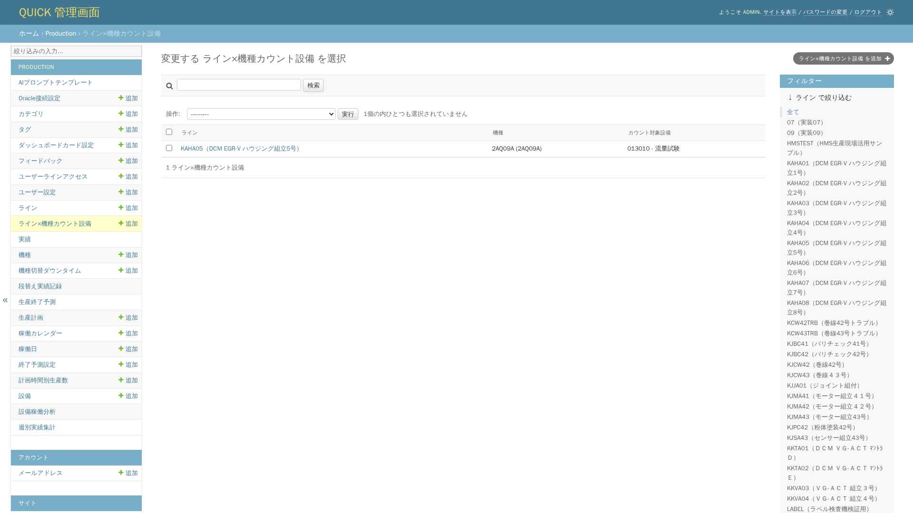

計画画面で設定したカウント対象設備は、この管理画面でも確認・編集できます。

---

## よくある操作

### 日常業務の流れ

```
朝の作業:
  1. ログイン
  2. ライン一覧で全体状況を確認
  3. 遅延ラインのダッシュボードを確認
  4. 必要に応じてAI分析を実行

計画入力:
  1. 計画管理 → 対象ラインを選択
  2. 日付を選択 → 「新規計画」
  3. 機種・設備・時間・数量を入力
  4. （初回のみ）カウント対象設備を設定
  5. 「作成」で保存

実績確認:
  1. ダッシュボードで時間別の進捗を確認
  2. 遅延がある場合 → AI分析で原因を確認
  3. 実績一覧で詳細データを確認・CSVエクスポート

トラブル対応:
  1. トラブル分析画面でKPIを確認
  2. パレート図・ヒートマップで主要原因を特定
  3. AI分析で改善提案を確認
  4. 詳細データをCSVエクスポートして報告に活用
```

### ナビバーのメニュー

| メニュー | 内容 |
|---|---|
| **計画管理** | 生産計画の一覧・作成・編集・Excel一括登録 |
| **実績管理** | Oracle実績の閲覧・フィルタ・CSV出力 |
| **トラブル分析** | 設備トラブルの多角分析・AI分析 |
| **分析** | 週次・月次の分析グラフ |
| **マスタ管理** | ライン選択・ラインアクセス設定 |
| **ライン一覧** | 全ラインの一覧表示 |
| **管理** | Admin管理画面へのリンク |

---

## トラブルシューティング

### 画面が表示されない
- ブラウザを更新（F5）してみてください
- URLが正しいか確認: `http://10.168.124.32:8001/`

### 実績が0のまま更新されない
- ダッシュボードのカウント対象設備が正しく設定されているか確認
- 計画画面で該当機種のカウント対象設備を確認・再設定してください
- それでも解消しない場合は管理者に連絡してください

### ダッシュボードの数値がおかしい
- 日付が正しいか確認してください
- 「昼勤のみ」「夜勤のみ」の表示切り替えを確認してください

### トラブル分析画面にデータが表示されない
- Oracle接続が正常か管理者に確認してください
- シフト切り替え（全体/昼勤/夜勤）を確認してください
- 対象日のトラブルデータが存在しない場合は「データなし」と表示されます

### Excel一括登録でエラーが出る
- 機種名がシステムに登録済みのものと完全一致しているか確認してください
- 日付の形式が正しいか確認してください（YYYY-MM-DD）
- テンプレートの列順を変更していないか確認してください

### 管理者に連絡が必要な場合
- ログインできない
- ラインが表示されない（アクセス権限が必要）
- 設備やOracle接続設定の変更
